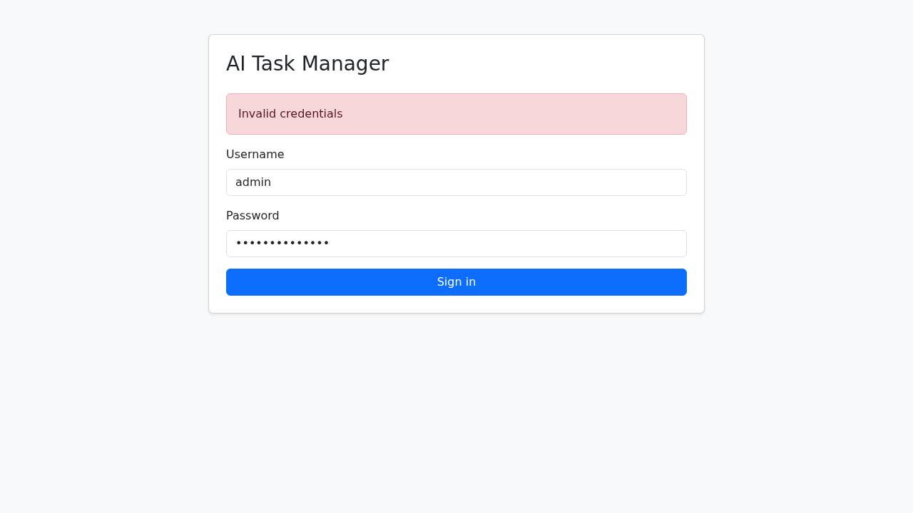
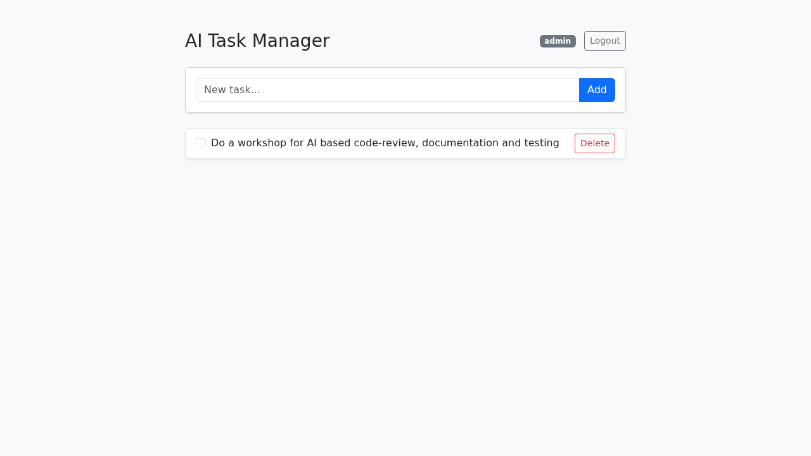
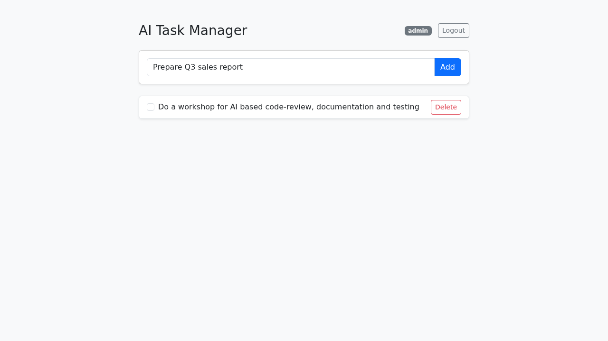
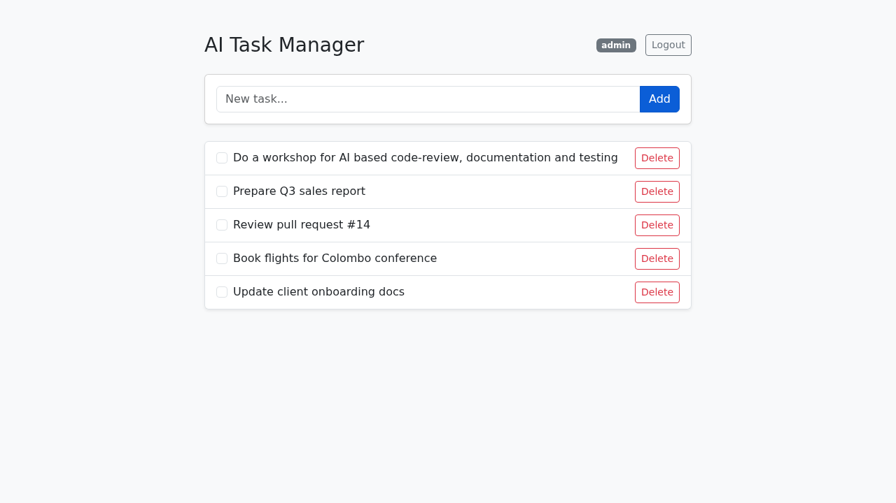
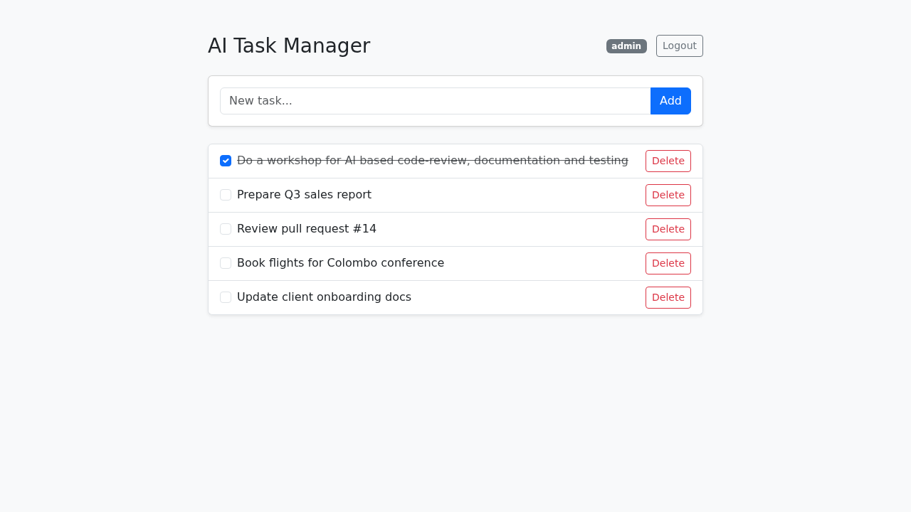
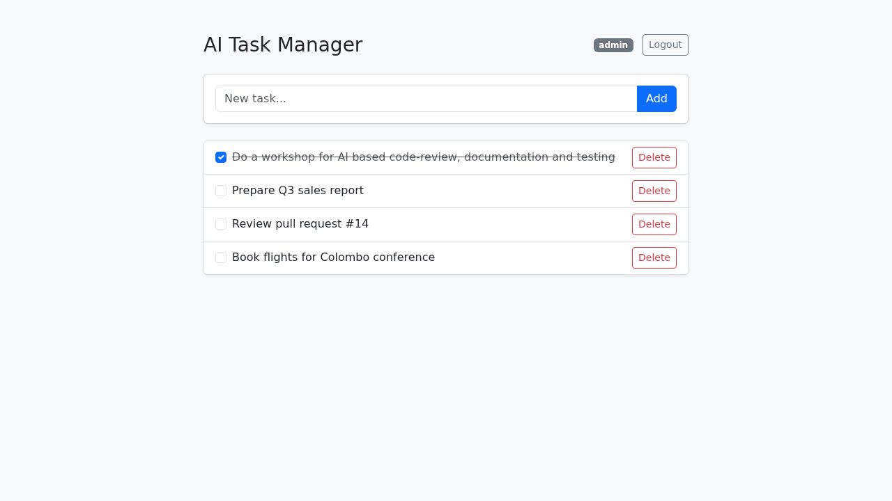
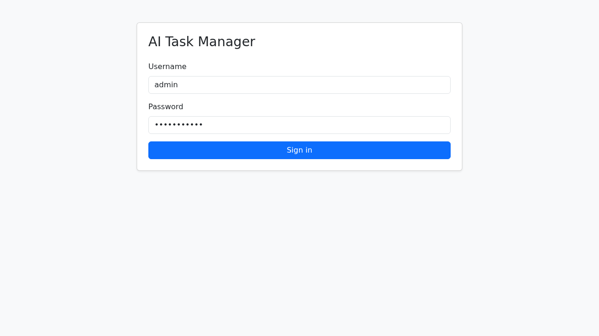
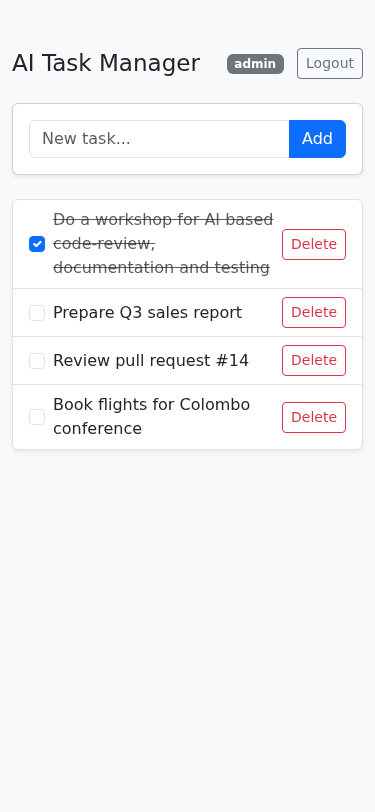

# AI Task Manager — User Guide

A simple, fast task manager. Sign in, add tasks, tick them off, delete what you no longer need. This guide walks you through every screen and action.

---

## Getting Started

### Accessing AI Task Manager

- **URL**: `http://localhost:5000` (or `http://<server-ip>:5000` on your network)
- **Supported browsers**: Chrome, Firefox, Safari, Edge
- **Mobile**: Fully responsive — works in any mobile browser, no app install needed

### Default Account

| Username | Password |
|----------|----------|
| `admin` | `password123` |

> **Tip:** You can change your username and password via the API (`PUT /profile`) — see the [API Reference](api.md).

### Your First 5 Minutes

1. Open the app and **sign in** with the default account
2. **Add your first task** using the input box at the top
3. **Tick the checkbox** when it's done — that's the whole workflow

---

## Signing In

When you open the app, you'll see the sign-in screen. The username field is pre-filled with `admin` for the demo.


### How To: Sign In

1. Enter your **username**
2. Enter your **password**
3. Click **Sign in** — you'll land on your task dashboard

If your credentials are wrong, you'll see an error banner and can simply try again:



> **Tip:** Your session is remembered — if you reload the page while signed in, you go straight to the dashboard without logging in again.

---

## The Dashboard

Everything happens on one screen.



### What You'll See

| Area | What it does |
|------|-------------|
| **Top bar** | App title, your username badge, and the **Logout** button |
| **Add task card** | Text input + **Add** button for creating tasks |
| **Task list** | Your tasks, each with a checkbox, title, and **Delete** button |
| **Empty state** | "No tasks yet" prompt when your list is empty |

### What You Can Do

- **Add** a task
- **Complete / un-complete** a task (checkbox)
- **Delete** a task
- **Log out**

Tasks are private — each user sees only their own list.

---

## Working with Tasks

### How To: Add a Task

1. Click into the **"New task..."** input box and type your task title

   

2. Click **Add** (or press **Enter**) — the task appears in the list immediately

   

> **Tip:** Press **Enter** instead of clicking Add — it's faster when entering several tasks in a row.

**Rules:** titles can't be empty and are limited to 200 characters. Leading/trailing spaces are trimmed automatically.

### How To: Complete a Task

1. Click the **checkbox** on the left of the task
2. The title is struck through and greyed out to show it's done

   

> **Tip:** Clicking the checkbox again un-completes the task — nothing is lost if you tick one by mistake.

### How To: Delete a Task

1. Click the red **Delete** button on the right of the task
2. The task is removed immediately

   

> **Note:** Deletion is permanent — there is no undo or recycle bin.

---

## Logging Out

Click **Logout** in the top-right corner. You're returned to the sign-in screen and your session is cleared.



---

## Using It on Mobile

The interface adapts to small screens — same features, no extra setup:



---

## How a Task Moves Through the System

```
 Sign in  →  Add task  →  Work on it  →  Tick complete  →  Delete
    ↓            ↓                            ↓                ↓
[Dashboard]  [Task list]              [Strikethrough]     [Removed]
```

---

## Troubleshooting

### "Invalid credentials" when signing in
**What it means**: The username/password combination doesn't match any account.
**How to fix**: Check for typos. The demo account is `admin` / `password123` (case-sensitive).

### "Method Not Allowed" when opening /login in the browser
**What it means**: `/login` is an API endpoint that only accepts POST requests — visiting it directly in the address bar sends a GET.
**How to fix**: Just open the app root (`/`) — the sign-in form is there.

### My tasks disappeared after the server restarted
**What it means**: The demo stores data in SQLite inside the Docker container. Removing the container deletes the database.
**How to fix**: Mount a volume for `/app/instance` when running the container to persist data.

### I'm suddenly back at the login screen
**What it means**: Your session cookie was cleared (browser cleared cookies, or the server's secret key changed after a restart).
**How to fix**: Sign in again — your tasks are still there.

### Common Questions

**Can I edit a task's title after creating it?**
Not from the UI currently — the API supports it (`PUT /tasks/{id}` with a new `title`), but the interface only exposes complete/delete. Delete and re-add as a workaround.

**Can multiple people use it?**
Yes — each user account has a fully separate task list. Additional accounts currently have to be created directly in the database or via seeding.

**Is there a keyboard shortcut reference?**
Only one: **Enter** submits the new-task form. There are no other shortcuts.

---

## For Developers

- **API reference**: [docs/api.md](api.md) — all endpoints with request/response shapes
- **Architecture**: [docs/architecture.md](architecture.md)
- **Database schema**: [docs/database-schema.md](database-schema.md)
